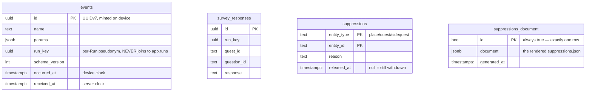

# Branch `backend-design-revision` — what it does, and the database it built

**Written 2026-08-16.** Every schema fact below was read out of the running database, not from
memory or from the design documents. Where this file and `docs/backend-supabase.md` disagree, the
design document is the design of record and this one is wrong.

---

# Part A — What this branch does

Before this branch the project was an iOS app with no server. It now has a deployed Postgres
backend, two client-side service kits that talk to it, a restored test suite for the presentation
layer, and two documents covering the human work nobody can do from a keyboard.

Four strands, in the order they happened.

## A1. A Supabase backend, designed then deployed

`.claude/plans/supabase/b0`–`b3` designed it; `docs/backend-supabase.md` is the design of record.
The result is **18 forward-only migrations, 4 Edge Functions and 236 assertions**, deployed to
`Histoplora` (`ppwcxmvetmmwliusliac`, ap-southeast-1) and matching this repository exactly.

The design has three load-bearing ideas:

1. **User data and content are separate stores.** The server holds no quest, place or lore. A `Run`
   points at content by string id plus a pinned `content_version`, so replacing content never
   orphans somebody's completed walk.
2. **Everything works offline.** There is no reachability check anywhere, on either side. The app's
   core flows never wait on a server.
3. **Telemetry is not joinable to a person.** `ops.events` has no `user_id` column and must never
   acquire one. Events carry a per-Run random `run_key` instead.

## A2. Edge Services phase 0 — making the deployed server do something

`.claude/plans/supabase/c1`. The backend existed and **nothing called it.** This strand closed the
smallest useful part of that gap:

| Built | What it is |
|---|---|
| `publish-suppressions` | The kill-switch publisher. Migration 0004 had maintained `ops.suppressions_document` since day one and nothing read it, so `AD-5`'s kill-switch was a release gate with no release — a place could be withdrawn in the database and no installed app would ever hear about it. |
| `GovernanceKit` | Swift package target. Fetches that published document, keeps the last good copy, never blocks launch. |
| `TelemetryKit` | Swift package target. Durable local queue, opportunistic flush, `POST /functions/v1/ingest`. A 200 marks rows sent; anything else leaves them queued. |
| `UUIDv7` | RFC 9562 §5.7 in `RunEngine`. Time-ordered ids, so device-generated primary keys stop bloating the index. |

**Neither kit is called by the app yet, deliberately.** They are library products with tests and no
callers, because *when* the app fetches and *what* it records are product decisions.

## A3. Restoring 112 deleted test guards

`.claude/plans/m7-restore-test-guards.plan.md`. Commit `b597b5b` had deleted the presentation
layer's entire test suite. This branch added a `challange-5Tests` unit-test target and restored them
— **110 tests, 0 failures.**

Restoring them was worth more than the tests: it surfaced two flow changes M8 had made that no plan,
document or requirement recorded.

- A fresh walk opens on a narrative story preview **before** the `FR-START-04` safety notice. Nothing
  is sampled, requested or written on that screen, so it does not violate the requirement's letter —
  but the ordering was undocumented. Resolved by a signed PRD amendment (§5.5, owner af) that splits
  the load-bearing half into a new **`FR-START-04a`**: acknowledgement must precede any sampling, any
  permission request, and any Run write.
- Arrival lands on the Hisplora story stages, not the checkpoint screen — five stages earlier than
  the tests expected. Recorded, and the test now asserts the stages *terminate* at the checkpoint,
  which is a stronger guard than the one it replaced.

Seven discovery guards were also re-pointed at a fixture instead of the shipped content tree. They
had gone red when an author replaced placeholder content, with no requirement having changed.

## A4. Consent and content — desk work, no invented values

Two documents for work only a human can do:

- `docs/consent-request-pack.md` — none of the five Badung sites has been approached; every consent
  record is a self-grant naming the project team. Per site: who to approach, what is being asked,
  what changes if they decline. Four blockers gate all five equally, including that **the app has no
  name**.
- `docs/field-verification-checklist.md` — every unverified content claim, in the order a person
  walking the route meets it. The two worst: Catur Muka's coordinate is in the wrong quadrant (~293 m
  out, outside even its 120 m radius, so that checkpoint probably never unlocks), and Museum Bali's
  `entryCost: 0` renders as "Free" for a museum that sells tickets.

## A5. The defect ledger

Nine defects were found by reading the schema and the functions back after deployment, plus one
optimisation. All are fixed and live.

| # | Defect | Where | Fixed by |
|---|---|---|---|
| 1 | `lore_dwell_ms` — a per-user *measurement* on a `user_id`-keyed row, contradicting the rule that privacy is "enforced by the absence of columns" | `app.checkpoint_results` | 0015 (column dropped, PRD amended) |
| 2 | Photo paths nullable, contradicting the design's own upload ordering three paragraphs away. A null path is an object nothing can find or erase | `app.photos` | 0015 (`not null`) |
| 3 | `service_role` had no statement or idle-in-transaction timeout — the one role that bypasses RLS and holds transactions open across Storage calls | roles | 0016 |
| 4 | Rate limiter released entries only when the same IP returned. `x-forwarded-for` is caller-controlled, so the key space belonged to the attacker — the limiter was a better DoS than the flood it stopped | `_shared/ratelimit.ts` | key ceiling + sweep + fail-closed |
| 5 | `ingest` parsed unbounded request bodies. The obvious fix (early 413 on `content-length`) **hangs**, because the body must be drained | `ingest` | bounded stream read |
| 6 | `listAll` never paged — the sweep `FR-SET-02` relies on truncated silently past 1000 entries | `_shared/storage.ts` | pagination + throws on failure |
| 7 | The photo read was capped by `max_rows = 1000`, truncating the same way from the database side | `delete-account` | paged read |
| 8 | `removeObjects` swallowed failures, so a Storage outage produced `{"deleted": true}` with every byte still in place | `_shared/storage.ts` | returns failures; caller 502s and deletes no rows |
| 9 | Autovacuum tuning covered the five tables that existed in 0010; 0012 added two more and never tuned them | `journal_entries`, `share_cards` | 0018 |
| — | **Optimisation:** eight indexes were strict prefixes of other indexes on the same table — pure write amplification on the sync tables | `app.*` | 0016 |

**Three shapes account for all of them**, and each now has a guard keyed on a *property* rather than
on a name, which is the only form that survives the next addition:

1. **A bounded read treated as complete** — defects 5, 6, 7, and the batch loop's 200 iterations.
2. **A list that enumerated the present** — defects 3 and 9. Both were a tuning migration that
   enumerated the world at the time, and a later migration adding a member without knowing a list
   existed.
3. **A design contradicting itself across sections** — defects 1 and 2, plus §15.4's "revisit the
   cursor overlap if the timeout changes" not firing when defect 3 changed exactly that timeout.

---

# Part B — The database, end to end

## B1. Schemas, and why there are four

| Schema | Holds | Exposed on the API? |
|---|---|---|
| `auth` | Supabase-managed users | via GoTrue only |
| `app` | All user data. 9 tables. RLS on every one | **Yes — the only one** |
| `ops` | Telemetry, survey responses, the kill-switch. 4 tables | **No** |
| `catalog` | Reserved for published content metadata. **Currently empty** | **No** |
| `public` | Deliberately empty | No (and nothing to expose) |

`config.toml` sets `[api] schemas = ["app"]`. That single line is the actual enforcement of "clients
never read `ops`" — it is evaluated **before** any RLS policy, so a schema absent from that list has
no HTTP surface at all, for any role including `service_role`. It is a security control, not a
preference.

This is also why the Supabase dashboard's Table Editor looks empty: it opens on `public`, which is
empty by design. Switch the schema selector to `app` or `ops`.

## B2. ERD

```mermaid
erDiagram
    users ||--o{ profiles : "1:1"
    users ||--o{ runs : owns
    users ||--o{ photos : owns
    users ||--o{ checkpoint_results : owns
    users ||--o{ task_results : owns
    users ||--o{ awards : owns
    users ||--o{ journal_entries : owns
    users ||--o{ share_cards : owns
    users ||--o{ sync_conflicts : owns

    runs ||--o{ checkpoint_results : "has ordered"
    runs ||--o{ photos : "groups"
    runs ||--o{ task_results : "groups"
    runs ||--o{ awards : "may grant"
    runs ||--o{ journal_entries : "may describe"
    runs ||--|| share_cards : "may render"

    checkpoint_results ||--o{ task_results : "has"
    photos |o--o{ task_results : "may answer"

    users {
        uuid id PK "auth.users, Supabase-managed"
    }
    profiles {
        uuid user_id PK_FK
        text display_name
        text preferred_language "id or en"
        timestamptz deleting_at "FR-SET-02 in progress"
    }
    runs {
        uuid id PK
        uuid user_id FK
        text quest_id "content id, NOT a foreign key"
        text content_version "pinned at start"
        text state "active/completed/abandoned"
        int current_checkpoint_index
        bigint server_seq "sync cursor"
    }
    checkpoint_results {
        uuid id PK
        uuid run_id FK
        text checkpoint_id "content id"
        int order_index
        text arrival_method "gps or manual"
        text gps_accuracy_bucket "lt20/b20_75/gt75"
        jsonb snapshot_lore "content copied at arrival"
    }
    task_results {
        uuid id PK
        uuid checkpoint_result_id FK
        uuid photo_id FK "nullable"
        text type "photo/reflection/question"
        bool skipped
        text answer_text
    }
    photos {
        uuid id PK
        uuid run_id FK
        text storage_path "NOT NULL since 0015"
        text thumb_path "NOT NULL since 0015"
        timestamptz uploaded_at "null until bytes land"
    }
    awards {
        uuid id PK
        uuid run_id FK
        text type "stamp/badge/letter"
        text source_id "content id"
        text snapshot_name
    }
    journal_entries {
        uuid id PK
        uuid run_id FK "nullable"
        text title
        text body
    }
    share_cards {
        uuid id PK
        uuid run_id FK
        text public_slug UK
        timestamptz expires_at
        timestamptz revoked_at
    }
    sync_conflicts {
        uuid id PK
        text table_name
        uuid row_id
        jsonb losing_row
        bigint winning_revision
    }
```

`ops` has no relationships to draw — that is the point:



**There is deliberately no line between `ops.events.run_key` and `app.runs.id`.** `run_key` is a
separate random UUID minted per Run and stored only on the device. The funnel stays analysable; the
join back to a person does not exist to be made.

## B3. The sync envelope — six columns, explained once

Seven `app` tables carry the same six columns. They are not clutter; they are the offline-sync
protocol, and repeating them per table beats a shared 1:1 metadata table (which would turn every
read into a join and break the single-index delta scan).

| Column | Type | Purpose |
|---|---|---|
| `device_id` | `uuid NOT NULL` | Which device wrote this revision. Used to attribute conflicts. |
| `revision` | `bigint NOT NULL DEFAULT 1` | Bumped by the client on each edit. Drives last-write-wins. |
| `created_at` | `timestamptz NOT NULL` | Device clock. **Cannot order a pull** — see `server_seq`. |
| `updated_at` | `timestamptz NOT NULL` | Device clock. Same caveat. |
| `server_seq` | `bigint NOT NULL DEFAULT nextval('app.sync_seq')` | The pull cursor. Server-assigned, overwritten on every insert and update by a trigger; whatever the client sends is discarded. |
| `deleted_at` | `timestamptz NULL` | Tombstone. Rows are never physically removed, so a deletion syncs as a deletion. |

**Why `server_seq` and not a timestamp.** `created_at`/`updated_at` are what the walker's phone
believed the time was. A phone three days slow writes a row stamped in the past, another device's
cursor is already beyond it, and that row is never pulled by anybody, ever. A server timestamp does
not fix it either: `now()` is transaction-start time, so a slow transaction can commit a row whose
stamp is older than a cursor that has already passed.

One shared sequence serves all tables, so gaps from rolled-back transactions stay harmless — the
reader only ever asks for *greater than*, never for "the next one".

**The known limitation.** A sequence value is claimed *before* commit, so a transaction that claims
500 and commits slowly can land behind a reader that has already passed 500. The pull carries a
100-value overlap and dedupes by `id`. That is a mitigation, not a proof: it holds only while no
transaction outlives its idle-in-transaction timeout. See `docs/backend-supabase.md` §15.4, which
now records that migration 0016 changed one of its two inputs.

## B4. `app` — table by table, column by column

### `app.profiles` — 7 columns

One row per user. Not part of delta sync (no `server_seq`): it is small, rarely written, and read
by the client directly.

| Column | Type | Null | Default | Meaning |
|---|---|---|---|---|
| `user_id` | `uuid` | no | — | **PK**, FK → `auth.users(id)` `ON DELETE CASCADE`. |
| `display_name` | `text` | yes | — | Optional; the app never requires a name. |
| `avatar_path` | `text` | yes | — | Storage object name, no bucket prefix. |
| `preferred_language` | `text` | yes | — | `CHECK IN ('id','en')`. |
| `deleting_at` | `timestamptz` | yes | — | Set by `delete-account` before it removes anything. The `trip_photos_insert` storage policy reads this to refuse uploads mid-deletion. |
| `created_at` | `timestamptz` | no | `now()` | Server clock here, unlike the sync tables. |
| `updated_at` | `timestamptz` | no | `now()` | |

### `app.runs` — 17 columns

One walk. The root of everything a user produces.

| Column | Type | Null | Default | Meaning |
|---|---|---|---|---|
| `id` | `uuid` | no | — | **PK**. Device-generated; should be UUIDv7. |
| `user_id` | `uuid` | no | — | FK → `auth.users` `CASCADE`. Also the RLS predicate. |
| `quest_id` | `text` | no | — | **A content id, deliberately not a foreign key.** Content lives in the app bundle and is replaced wholesale; a real reference would orphan or cascade-delete finished walks. |
| `content_version` | `text` | no | — | Pinned at start, so a summary can say which edition it was walked against. |
| `language` | `text` | no | — | `CHECK IN ('id','en')`. Pinned at start. |
| `state` | `text` | no | — | `CHECK IN ('active','completed','abandoned')`. |
| `current_checkpoint_index` | `integer` | no | `0` | Position in the fixed-order route. |
| `started_at` | `timestamptz` | no | — | |
| `completed_at` | `timestamptz` | yes | — | `CHECK`: must be non-null when `state = 'completed'`. |
| `abandoned_at` | `timestamptz` | yes | — | `CHECK`: with `abandon_reason`, both non-null when `state = 'abandoned'`. |
| `abandon_reason` | `text` | yes | — | `CHECK IN ('userChoice','placeSuppressed')`. The second is the kill-switch ending a walk. |
| *sync envelope* | | | | `device_id`, `revision`, `created_at`, `updated_at`, `server_seq`, `deleted_at` — see B3. |

**`runs_one_active_per_quest`** — a unique index on `(user_id, quest_id) WHERE state = 'active' AND
deleted_at IS NULL`. Partial, because a user may have many *finished* runs of one quest but only one
in progress.

### `app.checkpoint_results` — 20 columns

One arrival. Carries the content snapshot that makes a summary render forever.

| Column | Type | Null | Default | Meaning |
|---|---|---|---|---|
| `id` | `uuid` | no | — | **PK**. |
| `run_id` | `uuid` | no | — | FK → `app.runs` `CASCADE`. |
| `user_id` | `uuid` | no | — | Denormalised from the run so RLS evaluates without a join. |
| `checkpoint_id` | `text` | no | — | Content id. |
| `order_index` | `integer` | no | — | Position in the route. |
| `arrived_at` | `timestamptz` | no | — | |
| `arrival_method` | `text` | no | — | `CHECK IN ('gps','manual')`. Manual is the mandatory override for when GPS legitimately fails. |
| `gps_accuracy_bucket` | `text` | yes | — | `CHECK IN ('lt20','b20_75','gt75')`. **A band, never a metre figure** — accuracy metres at a known checkpoint at a known minute is a fingerprint. Tokens, not punctuation, so they survive JSON and a CSV. |
| `lore_first_opened_at` | `timestamptz` | yes | — | The *fact* that lore was opened. Not a duration — see below. |
| `stamp_awarded_at` | `timestamptz` | yes | — | |
| `snapshot_place_name` | `text` | no | — | Copied at arrival. |
| `snapshot_lore` | `jsonb` | no | — | Copied at arrival. **Never indexed** — nothing queries inside it, and a GIN index here would be write amplification serving no query while *looking* like diligence. |
| `snapshot_sources` | `jsonb` | no | — | Citations, copied at arrival. |
| `snapshot_content_version` | `text` | no | — | |
| *sync envelope* | | | | See B3. |

The four `snapshot_*` columns are the single denormalisation the whole design rests on: they are why
a summary renders correctly forever, offline, after content corrections and after a place is
withdrawn.

> **Removed by migration 0015: `lore_dwell_ms`.** A dwell *measurement* on a row keyed by `user_id`
> contradicts the rule that privacy here is enforced by the absence of columns. The metric survives
> anonymously as the `checkpoint_departed` event in `ops.events`, which has no user column.
> `lore_first_opened_at` stays because it is a fact the award rules read, not a duration.

**`checkpoint_results_one_per_checkpoint`** — unique on `(run_id, checkpoint_id) WHERE deleted_at IS
NULL`.

### `app.task_results` — 16 columns

One answer to one task. Tasks are keepsakes and **never gate progression** — the GPS radius is the
only gate.

| Column | Type | Null | Default | Meaning |
|---|---|---|---|---|
| `id` | `uuid` | no | — | **PK**. |
| `checkpoint_result_id` | `uuid` | no | — | FK → `app.checkpoint_results` `CASCADE`. |
| `run_id` | `uuid` | no | — | FK → `app.runs` `CASCADE`. Denormalised for querying a whole walk. |
| `user_id` | `uuid` | no | — | Denormalised for RLS. |
| `task_id` | `text` | no | — | Content id. |
| `type` | `text` | no | — | `CHECK IN ('photo','reflection','question')`. |
| `skipped` | `boolean` | no | — | **A stored fact, not the absence of one.** Skipping is recorded the same way answering is. |
| `answer_text` | `text` | yes | — | |
| `photo_id` | `uuid` | yes | — | FK → `app.photos` **`ON DELETE SET NULL`** — deleting a photo must not delete the record that a task was done. |
| `completed_at` | `timestamptz` | no | — | |
| *sync envelope* | | | | See B3. |

**`task_results_one_per_task`** — unique on `(checkpoint_result_id, task_id) WHERE deleted_at IS NULL`.

### `app.photos` — 18 columns

Checkpoint photographs only. **A sidequest photograph has no row here at all** — it stays on the
device with no opt-in that reverses it.

| Column | Type | Null | Default | Meaning |
|---|---|---|---|---|
| `id` | `uuid` | no | — | **PK**. Also the filename stem. |
| `user_id` | `uuid` | no | — | FK → `auth.users` `CASCADE`. |
| `run_id` | `uuid` | yes | — | FK → `app.runs` `CASCADE`. |
| `checkpoint_id` | `text` | yes | — | Content id. |
| `storage_path` | `text` | **no** | — | `{user_id}/{run_id}/{id}.heic`, 1600 px. **No bucket prefix** — Supabase keeps the bucket in `storage.objects.bucket_id`, so a path written as `trip-photos/…` makes the policy compare a bucket name against a uid and match nothing. |
| `thumb_path` | `text` | **no** | — | `{user_id}/{run_id}/{id}_t.heic`, 400 px. |
| `content_type` | `text` | yes | — | `CHECK IN ('image/heic','image/jpeg')`. |
| `width_px` / `height_px` | `integer` | yes | — | Of the full derivative, so a grid can lay out before downloading. |
| `byte_size` | `integer` | yes | — | Full + thumb, for the storage report and orphan detection. |
| `captured_at` | `timestamptz` | no | — | |
| `uploaded_at` | `timestamptz` | yes | — | **Null until the bytes are actually on the server.** |
| *sync envelope* | | | | See B3. |

**The upload order is a design decision, not an implementation detail.** Row first, with both paths
set and `uploaded_at` null; then the thumb; then the full; then `uploaded_at = now()`. The reverse
leaves an object nobody can find, nobody can delete, and which still counts toward the deletion
obligation. Of the two possible half-states only one is survivable.

> Both paths became `NOT NULL` in migration 0015. They had been nullable, contradicting that
> ordering — and a row with a null path is not resumable and cannot be deleted by path.

**`photos_pending_upload`** — partial index on `(user_id, captured_at) WHERE uploaded_at IS NULL AND
deleted_at IS NULL`, i.e. exactly the resume queue.

### `app.awards` — 13 columns

Stamps, badges and letters. `snapshot_name` is copied so an award survives its content being
withdrawn.

| Column | Type | Null | Meaning |
|---|---|---|---|
| `id` | `uuid` | no | **PK**. |
| `user_id` | `uuid` | no | FK → `auth.users` `CASCADE`. |
| `run_id` | `uuid` | yes | FK → `app.runs` `CASCADE`. Nullable: not every award comes from a run. |
| `type` | `text` | no | `CHECK IN ('stamp','badge','letter')`. |
| `source_id` | `text` | no | Content id of the thing awarded. |
| `snapshot_name` | `text` | no | Copied at award time. |
| `awarded_at` | `timestamptz` | no | |
| *sync envelope* | | | See B3. |

**`awards_one_per_source`** — unique on `(user_id, run_id, type, source_id) NULLS NOT DISTINCT WHERE
deleted_at IS NULL`. `NULLS NOT DISTINCT` matters: without it, two awards with a null `run_id` would
both be allowed.

### `app.journal_entries` — 11 columns

Free-text writing about a walk. The most update-heavy table in the schema — an entry is edited
repeatedly, and every edit bumps the indexed `server_seq`.

| Column | Type | Null | Default | Meaning |
|---|---|---|---|---|
| `id` | `uuid` | no | — | **PK**. |
| `user_id` | `uuid` | no | — | FK → `auth.users` `CASCADE`. |
| `run_id` | `uuid` | yes | — | FK → `app.runs` `CASCADE`. Nullable — an entry need not be about a walk. |
| `title` | `text` | yes | — | |
| `body` | `text` | no | `''` | Defaults to empty rather than null, so an entry always has a body to append to. |
| *sync envelope* | | | | See B3. |

### `app.share_cards` — 14 columns

A rendered image of a finished walk, optionally published behind an unguessable slug.

| Column | Type | Null | Meaning |
|---|---|---|---|
| `id` | `uuid` | no | **PK**. |
| `user_id` | `uuid` | no | FK → `auth.users` `CASCADE`. |
| `run_id` | `uuid` | no | FK → `app.runs` `CASCADE`. |
| `template` | `text` | no | Which layout was rendered. |
| `storage_path` | `text` | no | Object name in `share-cards`. |
| `public_slug` | `text` | yes | **UNIQUE.** Null until shared. |
| `expires_at` | `timestamptz` | yes | Sharing is time-boxed by default. |
| `revoked_at` | `timestamptz` | yes | Un-sharing without deleting the card. |
| *sync envelope* | | | See B3. |

### `app.sync_conflicts` — 8 columns

A ledger, not user data. Written by a trigger when last-write-wins discards a revision, so the
losing version is never silently gone.

| Column | Type | Null | Default | Meaning |
|---|---|---|---|---|
| `id` | `uuid` | no | `gen_random_uuid()` | **PK**. Server-generated — this row is not device-authored. |
| `user_id` | `uuid` | no | — | FK → `auth.users` `CASCADE`. |
| `table_name` | `text` | no | — | Which table the conflict was on. |
| `row_id` | `uuid` | no | — | Which row. |
| `losing_row` | `jsonb` | no | — | The whole discarded version. |
| `winning_revision` | `bigint` | no | — | |
| `losing_revision` | `bigint` | no | — | |
| `recorded_at` | `timestamptz` | no | `now()` | |

No sync envelope: it is server-authored, insert-only, and read once.

## B5. `ops` — telemetry, and the kill-switch

Not on the API. Reachable only by `service_role`, through Edge Functions.

### `ops.events` — 7 columns

| Column | Type | Null | Default | Meaning |
|---|---|---|---|---|
| `id` | `uuid` | no | — | **PK**. Minted on device as UUIDv7, so a retried flush hits `ON CONFLICT DO NOTHING` and is not a duplicate row. |
| `name` | `text` | no | — | Event name. |
| `params` | `jsonb` | no | `'{}'` | Free-form, but **no coordinate and no raw accuracy ever travels**. |
| `run_key` | `uuid` | yes | — | Per-Run pseudonym. Random, device-stored, **never written to `app.runs`**. |
| `schema_version` | `integer` | no | — | A row in an unknown shape is rejected, not stored. |
| `occurred_at` | `timestamptz` | no | — | Device clock. |
| `received_at` | `timestamptz` | no | `now()` | Server clock. **Retention keys on this**, because a device with a wrong date would otherwise age its rows out on arrival, or never. |

**There is no `user_id` column and there must never be one.**

### `ops.survey_responses` — 7 columns

`id`, `run_key`, `quest_id`, `question_id`, `response`, `occurred_at`, `received_at`.

This is the recall-survey corpus, not telemetry. **It is deliberately never pruned** — the client
already singles it out as the one thing it never drops, and a retention job that aged it out would
delete the study while looking like hygiene. That leaves it unbounded, which is a known cost.

### `ops.suppressions` — 5 columns

The kill-switch input. `entity_type` + `entity_id` form the **composite primary key**.

| Column | Type | Null | Default | Meaning |
|---|---|---|---|---|
| `entity_type` | `text` | no | — | **PK part.** `CHECK IN ('place','quest','sidequest')`. |
| `entity_id` | `text` | no | — | **PK part.** A content id. |
| `reason` | `text` | no | — | Why it was withdrawn. |
| `suppressed_at` | `timestamptz` | no | `now()` | |
| `released_at` | `timestamptz` | yes | — | **Null means still withdrawn.** This is what makes a withdrawal reversible rather than a delete. |

### `ops.suppressions_document` — 3 columns

Exactly one row, forever.

| Column | Type | Null | Default | Meaning |
|---|---|---|---|---|
| `id` | `boolean` | no | `true` | **PK**, with `CHECK (id)` — so `true` is the only permitted value and a second row is structurally impossible. |
| `document` | `jsonb` | no | — | The rendered schema-2 `suppressions.json`. |
| `generated_at` | `timestamptz` | no | `now()` | |

Maintained by an `AFTER … FOR EACH STATEMENT` trigger on `ops.suppressions`. Postgres cannot write
object bytes into Storage, so the trigger does the part that must be transactional — deriving the
document atomically from the same statement that changed a suppression — and publication is a read
of this one row by a privileged caller.

## B6. Row-level security

Every `app` and `ops` table has RLS **enabled and forced** (forced means even the table owner is
subject to it). `ops` tables have **no policies at all**, which is deny-all — they are reachable
only by `service_role`, which bypasses RLS.

Every `app` policy has the same shape:

```sql
CREATE POLICY runs_select ON app.runs FOR SELECT TO authenticated
  USING (user_id = (SELECT auth.uid()));
```

Three things about that line are deliberate:

1. **`(SELECT auth.uid())`, not `auth.uid()`.** Wrapping it in a sub-select lets the planner evaluate
   it once per query instead of once per row.
2. **`TO authenticated`, not the default `PUBLIC`.** An anonymous walker holds a real JWT and *is*
   `authenticated` as far as Postgres roles are concerned — anonymity is a claim, not a role. A
   policy naming a role it does not intend is one that stops matching the grants the day somebody
   "fixes" a permission error with a `GRANT`.
3. **`user_id` is denormalised onto every child table** so this predicate never needs a join.

**There is no `DELETE` policy on any table.** Deletion is a tombstone (`deleted_at`), or it is
`delete-account` running as `service_role`. A client cannot hard-delete anything.

Storage is a **second authorisation system** with its own policies on `storage.objects`, covering
all four verbs on both private buckets — bucket policies are frequently written for `SELECT` only,
leaving insert/update/delete open. The `trip_photos_insert` policy additionally refuses uploads
while `profiles.deleting_at` is set, which narrows the race where an upload lands after deletion has
already swept.

## B7. Functions

| Function | Definer | Callable by | Purpose |
|---|---|---|---|
| `app.ingest_batch(jsonb)` | yes | `service_role` | Inserts telemetry and survey rows by **named columns**, so a `user_id` in the payload is ignored rather than stored. Rejects unknown `schema_version`; caps a batch at 200 rows. |
| `app.delete_account_batch(uuid, int)` | yes | `service_role` | Deletes one user's rows leaf-first in bounded batches, committing between them, so one giant cascade never takes every lock at once. |
| `app.merge_anonymous_rows(uuid, uuid)` | yes | `service_role` | Re-points an anonymous account's rows at a real one when a walker signs up after walking. |
| `app.anonymous_cull_candidates(interval)` | yes | `service_role` | Lists anonymous accounts eligible for retention culling. |
| `app.published_suppressions()` | yes | `service_role` | Reads the one `ops.suppressions_document` row. Exists because `ops` is off the API, so PostgREST cannot reach it for *any* role. |
| `ops.prune_events(interval)` | yes | `service_role` | Retention. Deletes `ops.events` older than the horizon (default 180 days). |
| `app.stamp_server_seq()` | **no** | trigger only | Overwrites `server_seq` on every insert and update. Not a definer: a `BEFORE` trigger already sets the value regardless of what the caller sent, so definer rights would buy nothing and only widen the blast radius. |
| `app.resolve_sync_conflict()` | yes | trigger only | Last-write-wins, recording the loser into `app.sync_conflicts`. Definer because it must write past that table's forced RLS. |
| `ops.rebuild_suppressions_document()` | **no** | trigger only | Regenerates the published document. |

Every one pins `SET search_path = ''` with all names schema-qualified, and every one had `EXECUTE`
revoked from `PUBLIC` — Postgres grants it by default, which would otherwise make definer functions
callable as `/rest/v1/rpc/…` by anyone.

## B8. Indexes

Four families:

- **Foreign-key support** (`*_run`, `task_results_checkpoint`, `task_results_photo`). Postgres does
  **not** index FK columns automatically, so without these every `ON DELETE CASCADE` sequentially
  scans the child table.
- **Pull cursors** — `(user_id, server_seq)` on all seven syncable tables. The delta-sync query
  filters on the first and orders by the second.
- **Uniqueness rules**, all partial on `WHERE deleted_at IS NULL` so a tombstone never blocks a
  legitimate new row: one active run per quest, one result per checkpoint, one result per task, one
  award per source.
- **`ops` analytics** — BRIN on `received_at` (append-only and monotonic, so a BRIN is kilobytes
  where a B-tree would be megabytes), GIN on `params`, B-tree on `(name, occurred_at)`.

> Migration 0016 dropped **eight** indexes that were strict prefixes of others on the same table
> (`awards_user` under `awards_pull`, and so on; `profiles_user` duplicated the primary key
> outright). A B-tree on `(a, b)` serves `WHERE a = ?` exactly as well as one on `(a)`, so the
> shorter one earned nothing and cost a write on every insert and update — on the sync tables, the
> hottest path there is. A pgTAP guard now fails if a redundant one is reintroduced.

## B9. Storage buckets

| Bucket | Public | Size limit | MIME types |
|---|---|---|---|
| `trip-photos` | no | 10 MiB | `image/heic`, `image/jpeg` |
| `share-cards` | no | 10 MiB | `image/png`, `image/jpeg` |
| `content` | **yes** | none | any |

The per-bucket limit is set explicitly rather than left to the global config: **a bucket row with a
NULL limit is unlimited** — it does not inherit — so a global setting alone describes an intention
that nothing enforces. This was found by a test that uploaded 11 MiB successfully against a bucket
the design believed was capped.

`content` is public-read and service-role-write, with no write policy for any client role. It holds
`suppressions.json`.

## B10. Scheduled jobs

| Job | Schedule | Command |
|---|---|---|
| `ops-prune-events` | `17 3 * * *` | `select ops.prune_events()` |

Runs via `pg_cron`, inside the database — no external scheduler to own, no secret to hold, nothing
to forget to deploy. Scheduled at :17 deliberately, because every naive scheduler picks :00.

## B11. Edge Functions

| Function | JWT | Purpose |
|---|---|---|
| `ingest` | **false** | Anonymous telemetry. Deliberately unauthenticated: insert-only RLS for `anon` would be simpler and is rejected, because it hands every installed copy of the app a token that writes directly to the database. Batch caps, schema-version rejection, body-size limits and rate limiting live here instead. |
| `delete-account` | true | `FR-SET-02`. Cannot be one transaction — Postgres and object storage are two systems — so the order makes the *surviving* state safe: flag, then objects, then rows in batches, then the identity. |
| `merge-anonymous` | true | Links a walk taken anonymously to a real account, copying storage objects before deleting the originals. |
| `publish-suppressions` | true | Reads the kill-switch document and writes it whole to the `content` bucket. Operator tool; additionally refuses any bearer that is not the service role. |

---

# Part C — Migration history

Forward-only. A merged migration is never edited; a correction is a new file.

| # | File | What it does |
|---|---|---|
| 0001 | `schemas_roles_grants` | The four schemas, role grants, and the revokes that make `ops` unreachable. |
| 0002 | `role_settings` | Statement and idle-in-transaction timeouts on `authenticated` and `anon`. Second on purpose, so every later migration runs under the timeouts production uses. |
| 0003 | `ops_tables` | `events`, `survey_responses`, `suppressions`, and `ingest_batch`. |
| 0004 | `ops_suppressions_publish` | `suppressions_document` and the trigger that maintains it. |
| 0005 | `sync_sequence` | `app.sync_seq` and `stamp_server_seq`. |
| 0006 | `app_tables` | The seven core user tables. |
| 0007 | `app_indexes` | FK support, pull cursors, uniqueness rules. |
| 0008 | `app_rls` | RLS enabled, forced, and policies on every table. |
| 0009 | `storage_buckets` | Three buckets and all four verbs of policy on each private one. |
| 0010 | `app_autovacuum` | Tightened autovacuum on the five sync tables that existed then. |
| 0011 | `sync_conflicts` | The conflict ledger and `resolve_sync_conflict`. |
| 0012 | `journal_share` | `journal_entries` and `share_cards`. |
| 0013 | `least_privilege_hardening` | Revoked `PUBLIC` execute on definer functions; scoped policies `TO authenticated`. From advisors the local stack does not run. |
| 0014 | `publish_suppressions_accessor` | `app.published_suppressions()`, so the publisher can read a schema that is off the API. |
| 0015 | `privacy_and_photo_path_integrity` | Dropped `lore_dwell_ms`; made both photo paths `NOT NULL`. **First non-additive migration.** |
| 0016 | `index_dedup_and_service_role_timeouts` | Dropped 8 redundant indexes; gave `service_role` the timeouts 0002 omitted. |
| 0017 | `ops_retention` | `ops.prune_events`, `pg_cron`, and the scheduled job. |
| 0018 | `autovacuum_for_late_sync_tables` | The tuning `journal_entries` and `share_cards` never received. |

---

# Part D — Running and deploying

From the repository root, with Docker running:

```bash
supabase start
supabase db reset && supabase db lint -s app,ops,catalog,public --fail-on warning && supabase test db
supabase functions serve          # REQUIRED for the Deno suites — see below
deno test --allow-net --allow-env --allow-run supabase/tests/functions/
deno test --allow-net --allow-env --allow-run supabase/tests/http/
deno test --allow-net --allow-env --allow-run supabase/tests/concurrency/
```

**236 assertions**: 165 pgTAP + 50 + 13 + 8 Deno.

Two things that will otherwise cost an hour:

- **`supabase functions serve` must be running.** On this machine `supabase start` brings up no
  edge-runtime container, so without it every function test fails with
  `503 {"message":"name resolution failed"}` — which reads like a code failure and is not one.
- **Scope `db lint` to the four schemas the repo owns.** pgTAP installs ~90 functions of its own and
  an unscoped lint reports upstream warnings for them.

Deploying, in order:

```bash
supabase link --project-ref ppwcxmvetmmwliusliac
supabase db push --dry-run
supabase db push
supabase config push
supabase functions deploy <name>
# then the HTTP suite against the deployed URL
```

**`config push` is not optional.** `[api] schemas = ["app"]` and `max_rows` are security controls,
and a hosted project defaults to exposing `public, graphql_public` instead. Note that `config push`
reports "up to date" after a change to `[functions.*] verify_jwt` — those are applied by `functions
deploy`, and verified with `supabase functions list`.

**Isolation is proved over HTTP, never by a query.** An elevated connection bypasses RLS, which
makes it good for asking what a table contains and worthless for proving who can read it. The HTTP
suite uses real user tokens, and it cleans up the accounts it creates.

---

# Part E — Known gaps

Honest list; none of these is hidden in a comment somewhere.

**Blocked on people, not code**

1. **The app has no name.** Blocks submission and all five consent approaches.
2. **No site has been approached.** Every consent record is a self-grant naming the project team,
   with signatory fields still literal placeholders.
3. **The route has never been walked.** Every coordinate is an unverified seed; one is in the wrong
   quadrant. Distances and durations are estimates while the JSON claims walking-directions
   provenance.

**Blocked on a decision**

4. **`FR-CP-05`'s Story Reveal exception** is still undocumented in the PRD, with no owner named.
   The comparable `FR-START-04` exception was signed; this one was not.
5. **Nothing invokes `publish-suppressions` on a schedule.** It is callable and has been called by
   hand. Putting it on a timer waits on the Edge Services ownership decision.
6. **Neither client kit is wired into the app.** When the app fetches, and what it records, are
   product decisions.
7. **Region and Indonesian PDP law (UU 27/2022)** — the controller and cross-border transfer need an
   owner.

**Known technical limits**

8. **The rate limiter is per-worker.** It stops a loop from one client, not a distributed flood. A
   real limit needs a shared counter, which is itself IP retention — so it is blocked on the same
   IP-handling decision as the log-retention question.
9. **`ops.survey_responses` is unbounded**, deliberately.
10. **The pull cursor's 100-value overlap** is a mitigation, not a proof, and migration 0016 changed
    one of the two inputs it is derived from. Recorded in `docs/backend-supabase.md` §15.4 as a
    decision to make when the client pull is built.
11. **`byte_size` is nullable**, so the storage report can under-count silently. Not tightened
    because no document establishes the device knows it at insert time.
12. **Prod has no real users.** That is the only reason a destructive mistake there is currently
    survivable, and it will stop being true without anything announcing it.
